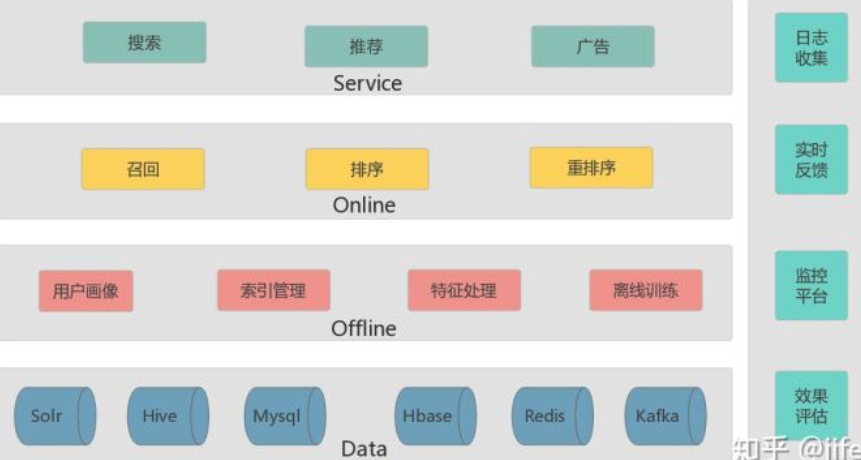

# 搜索

- 本质: 是一个匹配过程 (query 和 doc 的匹配)

## 语义匹配

1. 必要性  
    解决字面上不重叠, 但是语义层面相似的文本匹配问题
2. 方法
    - 建立词与词之间的语义匹配

# 推荐

## 本质

1. 召回和排序
    - 召回: 大量候选品中筛选出一批候选集
    - 排序: 对召回的候选集进行排序

## 总体架构

1. 离线推荐
    - 使用历史一段时间的数据进行训练 ->用户中长期兴趣
2. 在线训练
    - 根据在线反馈, 比如广告喜欢或不喜欢
    - 不需要离线存储开销

### 数据层

1. hive - 数据仓库工具
    - 提供类SQL增删改查，可以产生mapreduce的任务

2. Redis

3. mysql

### 计算层

1. Spark

### 排序层 - 基于某种策略的权重

LR/ DNN/ Wide&Deep

### 召回

兴趣爱好/ 基于内容推荐/ 协同过滤/ 热门爆款

### 服务层

搜索/ 推荐

### 业务层

关键词推荐/ 相关推荐/ 列表排序/ 搜索
