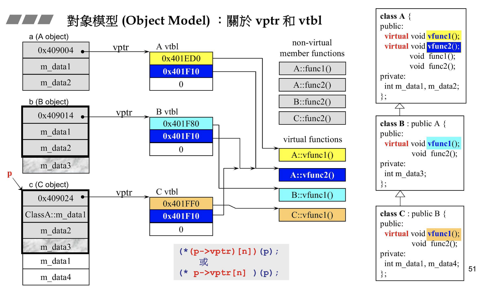

# Class相关

## 对象模型


## 构造函数

1. 线程安全
    - 不能在构造函数中暴露 this 指针
      - 若一开始需要注册回调, 那么需要构造好后单独再执行

2. 虚函数相关
    - 不能为虚函数, 构造函数的意义就是把这个类型给创建起来，地基都没有了谈什么  
    - 构造函数执行前虚指针与虚表已经完成, 因此构造函数中可以调用重写函数

3. 单例
    - 构造函数和析构函数由外部调用，设置为private则不能实例化，但可以通过static单例的方式创建在堆上  

4. 构造函数区别
    - 拷贝构造函数: 使用现有对象去初始化新对象, A a; -> A b(a); || A b = a;
    - 赋值(=)重载: 已有对象被重新赋值 a = b

## 析构函数

1. 线程安全

    - 不能使用成员锁去保证析构的线程安全
      - 若线程 A 占有锁并开始析构, 而线程 B 等待锁并阻塞, 此时析构会把锁删除, 那么 B 的行为会有问题

2. 虚函数相关

    - 如果基类有派生类，则必须有，否则会导致派生类的析构函数不能执行
    - 派生类析构函数调用重写函数：可以表现多态性  

## 空类的大小

（sizeof） = 1，声明类型的实例时，必须在内存中占有一定的内存  

## 友元函数

特点

- 不是类成员
- 可以让外部函数访问内部 private 和 protected 的数据

## 运算符重载  

1）参数个数  

- 成员函数:函数的参数个数比原来参与运算的运算数少一个: 重载一元运算符没有参数、重载二元运算符只有一个参数；比如，a + b 的参数为1个，a = b 的参数为1个 -> 因为含有 this 指针
- 友元函数:参数个数与原运算数个数相同，因为没有this指针  

2）<<和>>只能用友元函数来重载

- 为了保证使用cin或者cout  

```c
friend istream& operator >>(istream& in, MyClass& c);
istream& operator >>(istream& in, MyClass& c){
  in >> c
  return in;
}
```

## 类内成员变量初始化  

### 使用初始化列表

- 初始化顺序与初始化列表的顺序无关, 而与变量的定义顺序有关

```c
class Test
{
public:
  Test() : y(1), r(y), d(3){} //对于常量型成员变量和引用型成员变量，必须通过参数化列表的方式进行初始化。
  ~Test(){}

  int y;      //普通变量成员
  int& r;     //引用成员变量,C11之前必须通过参数初始化列表进行初始化
  const int d;    //常量成员变量，C11之前必须通过参数初始化列表进行初始化
  static int c;   //静态成员变量，不属于类的实例，必须在类外部定义实现
  static const int x = 2.1;   //静态常量整型成员变量
  static const int xx;        //静态常量整型成员变量声明
};
  
const int Test::xx = 4; //静态常量整型成员变量定义
int Test::c = 2;
```

## 类实例化的过程

1）分配空间  
2）初始化 -> 初始化列表, 因此参数产生在构造函数之前, 包括虚指针  
3）赋值 -> 通过构造函数  
<https://blog.csdn.net/gukesdo/article/details/7514080>

## 多态

### 定义

父类指针根据具体的子类对象, 来执行不同的函数  

```c++
Parent *p = NULL; // 创建一个父类的指针

Parent parent;
p = &parent; // 指向父类的对象
p->fun(); // 执行的是父类的 fun() 函数

Child child;
p = &child; // 指向子类的对象 -> 此时的虚表中会会现有基类然后再有子类
p->fun(); // 执行的是子类的 fun() 函数
```

### 注意

1. A* a = new B // 此时 a 是指 b 的指针, 因此实际是通过 b 内的虚表进行工作

## 虚函数与虚表  

### 参考

<https://www.cnblogs.com/skynet/p/3343726.html>

### 内存模型

#### 单一继承



1. 虚函数指针在变量表的最前面的位置, 成员变量按继承和声明放后面
2. 非虚函数不在虚表中
3. 子类的虚表先放基类虚函数的地址, 再放子类的虚函数, 若有重写, 则覆盖基类的地址

#### 多继承


1. 每个父类对应一个虚表。

### 纯虚函数

1. *纯虚函数会使用地址0来在虚表中占位，因此子类中必须重写，否则地址无效而无法继承

### 其它

1. 一个类产生的所有对象共用同一个虚表，则虚指针都相同，虚表在只读数据段(.rodata)
2. 虚指针初始化与参数初始化一起执行
3. 若子类没有虚函数，但是基类有，那么子类也会拥有虚表和虚指针(会继承)

## 接口

1. 接口方法使用纯虚函数修饰
2. 接口类无法创建对象, 因此不应该编写构造函数和析构函数
3. 可以声明静态常量作为接口的返回值状态

## 关键字

### protected  

1 可以用来保护基类不被创建, 而子类可以被创建

```c++
class A { 
protected: 
    A(){}
};
 
class B : public A
{
    public: B(){}
};
 
int main(int argc, char** argv){
    A a; // error
    B b; // ok
}
```

2 子类可以访问  

### private

1 可以创建单例

```c++
class A
{
private:
    A() {}
    ~A(){}
public:
    static A& Instance()
    {
        static A a;
        return a;
    }
};
 
int main() {
    A& ra = A::Instance();
}
```

2 只有自己可以访问  

3 基类中的private可以被派生类继承 -> 访问权限和const一样只是标识，而不影响强行功能

### explicit

1 修饰构造函数, 不能发生隐式类型转换

