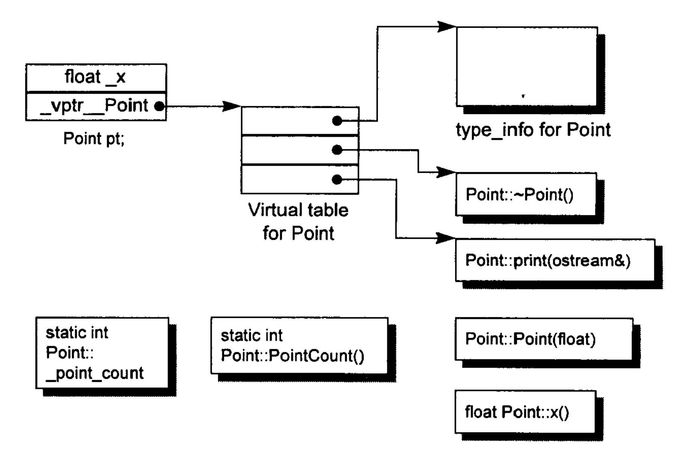

# Class相关

## 对象模型



## 构造函数

1. 线程安全
    - 不能在构造函数中暴露 this 指针，比如注册回调使用  
      - 若一开始需要注册回调, 那么需要构造好后单独再执行

2. 虚函数相关
    - 不能为虚函数, 构造函数的意义就是把这个类型给创建起来，地基都没有了谈什么  
    - 构造函数执行前虚指针与虚表已经完成, 因此构造函数中可以调用重写函数

3. 单例
    - 构造函数和析构函数由外部调用，设置为private则不能实例化，但可以通过static单例的方式创建在堆上  

4. 继承构造
    - 子类无构造函数，则调用父类无参数构造函数
    - 子类有构造函数，先调用父类无参数再调用子类
    - 父类只有参数构造函数，子类必须调用并赋值

## 拷贝构造函数

1. 拷贝构造函数: 使用现有对象去初始化新对象, A a; -> A b(a); || A b = a;
2. 引用传参的原因：若非引用，那么会拷贝赋值，会陷入死循环，栈溢出
3. 禁用拷贝构造和赋值的原因：
    - <http://blog.guorongfei.com/2016/04/24/why-delete-copy-constructor/>
    - 1.浅拷贝问题
        - 编译器会生成默认拷贝函数，但由于浅拷贝问题，若有buffer，那么只会拷贝buffer指针，导致两个对象指向同一个指针，一个对象被删除，那么原来的也会被删除
    - 2.基类拷贝构造问题
        - 若子类无拷贝构造，会调用基类的拷贝构造
        - 若子类有拷贝构造，会调用基类的默认拷贝构造
4. 拷贝构造时 *this指针其实可以使用了  

## 析构函数

1. 线程安全

    - 不能使用成员锁去保证析构的线程安全
      - 若线程 A 占有锁并开始析构, 而线程 B 等待锁并阻塞, 此时析构会把锁删除, 那么 B 的行为会有问题

2. 虚函数相关

    - 如果基类有派生类，则必须有，否则会导致派生类的析构函数不能执行
    - 派生类析构函数调用重写函数：可以表现多态性  

## 空类的大小

（sizeof） = 1，声明类型的实例时，必须在内存中占有一定的内存  

## 友元函数

特点

- 不是类成员
- 可以让外部函数访问内部 private 和 protected 的数据

## 操作符重载  

1. 参数个数  
    - 成员函数:函数的参数个数比原来参与运算的运算数少一个: 重载一元运算符没有参数、重载二元运算符只有一个参数；比如，a + b 的参数为1个，a = b 的参数为1个 -> 因为含有 this 指针
    - 友元函数:参数个数与原运算数个数相同，因为没有this指针  

2. << 和 >> 只能用友元函数来重载
    - 为了保证使用cin或者cout  

    ```c++
    friend istream& operator >>(istream& in, MyClass& c);
    istream& operator >>(istream& in, MyClass& c){
        in >> c
        return in;
    }
    ```

3. 不能重载的操作符
    - "."（成员访问运算符）
    - ".*"（成员指针访问运算符）
    - "::"（域运算符）
    - “siezof"（长度运算符）
    - " ?:"（条件运算符）

## 类内成员变量初始化  

### 使用初始化列表

- 初始化顺序与初始化列表的顺序无关, 而与变量的定义顺序有关

```c
class Test {
public:
  Test() : y(1), r(y), d(3){} //对于常量型成员变量和引用型成员变量，必须通过参数化列表的方式进行初始化。
  ~Test(){}

  int y;      //普通变量成员
  int& r;     //引用成员变量,C11之前必须通过参数初始化列表进行初始化
  const int d;    //常量成员变量，C11之前必须通过参数初始化列表进行初始化
  
  // 必须在外部声明
  static int c;   
  static constexper/const int x = 2.1;  
  static const int xx; // 此处不初始化，只能用const 
};

int Test::c = 2; // 必须类外实现
constexper/const int Test::x;  
constexper/const int Test::xx = 4; 
```

## 类实例化的过程

1）分配空间  
2）初始化 -> 初始化列表, 因此参数产生在构造函数之前, 包括虚指针  
3）赋值 -> 通过构造函数  
<https://blog.csdn.net/gukesdo/article/details/7514080>

## 多态

### 定义

- 基类指针指向子类来实现多态，基类指针可以指向派生类指针，反之不行 -> 考虑到指针大小问题，解释基类类型的指针总是小于派生类
- 误区：虽然基类指针指向了派生类，但是它类型仍然是基类，因此只能调用基类内的，或者子类虚函数过的

```c++
class A {
public:
    virtual void print() {}
    void testA();
};

class B: public A {
public:
    void print() {}
    void testB() {}
};

A* a = new B; // 内存布局为[A, B], 但是因为现在由A的类型解释，所以只能取到A的内存部分（虚函数重载或者A本身的函数与值）
a->print(); // B::print();
a->testA(); // ok
a->testB(); // error

// 向上转型：子类型转换成基类型，a 可以调用
A* a = new B // 隐式
A* a = static_cast<A*>(new B) // 显示

// 向下转型：基类型转换为子类型
B* b = new A // 隐式 error
A* a = new B
B* b = dynamic_cast<B*>(a); // 合法，因为本质上还是B的内存空间
B* b = static_cast<B*>(a); // 合法，因为本质上还是B的内存空间

// 若多继承
class A1 {};
class A2 {};
class B: public A1, public A2 {};
A1* a1 = new B;
A2* a2 = dynamic_cast<A2*> a1; // 合法，发现是B，会自动调节到A2上
A2* a2 = static_cast<A2*> a1; // 不合法，没有检测，直接判断错误
```

## 虚函数与虚表  

### 内存模型

<https://blog.csdn.net/qq_36359022/article/details/81870219>

1. 单一继承
    - 虚函数指针在变量表的最前面的位置, 成员变量按继承和声明放后面
    - 非虚函数不在虚表中
    - 子类的虚表先放基类虚函数的地址, 再放子类的虚函数, 若有重写, 则覆盖基类的地址

2. 多继承
    - 每个父类对应一个虚表。

### 纯虚函数

1. *纯虚函数会使用地址0来在虚表中占位，因此子类中必须重写，否则地址无效而无法继承

### 其它

1. 一个类产生的所有对象共用同一个虚表，则虚指针都相同，虚表在只读数据段(.rodata)
2. 虚指针初始化与参数初始化一起执行
3. 若子类没有虚函数，但是基类有，那么子类也会拥有虚表和虚指针(会继承)

## 接口

1. 接口方法使用纯虚函数修饰
2. 接口类无法创建对象, 因此不应该编写构造函数和析构函数
3. 可以声明静态常量作为接口的返回值状态

## 关键字

### protected  

1 可以用来保护基类不被创建, 而子类可以被创建

```c++
class A { 
protected: 
    A(){}
};
 
class B : public A
{
    public: B(){}
};
 
int main(int argc, char** argv){
    A a; // error
    B b; // ok
}
```

2 子类可以访问  

### private

1 可以创建单例

```c++
class A
{
private:
    A() {}
    ~A(){}
public:
    static A& Instance()
    {
        static A a;
        return a;
    }
};
 
int main() {
    A& ra = A::Instance();
}
```

2 只有自己可以访问  

3 基类中的private可以被派生类继承 -> 访问权限和const一样只是标识，而不影响强行功能

### explicit

1 修饰构造函数, 不能发生隐式类型转换

## 其他问题

1. 只能在栈上创建的类

    - 做法：
      - 将 operator new 设置为 private

2. 只能在堆上创建的类

    - 核心：
      - 编译器为对象分配栈空间时，会先检测析构函数，若为私有，则不会创建类
      - new 先分配内存，再调用构造函数
    - 做法：
      - 将析构函数设置为 private -> 为了解决继承问题设置为 protected
      - 单独写出 destroy 函数去删除类
