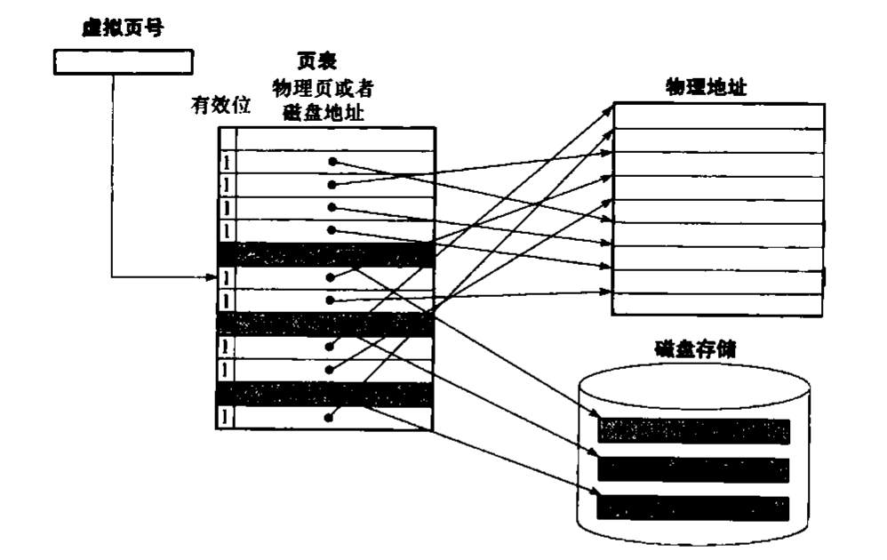
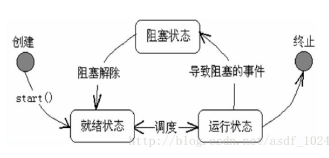

# 一.内存管理  

## 页表

1.定义：  
存放在物理内存中的数据结构，记录了虚拟页与物理页的映射关系  

## 虚拟内存

1.定义  

- 虚拟地址由程序生成，CPU需要将虚拟地址翻译成物理地址才能访问到数据，虚拟地址对于程序来说，让程序有一个连续的、巨大的地址空间  

2.基本原理  

- 虚拟地址 = 页号 + 偏移位
- 使用位：记录是否被使用  
- 脏位：若脏位被标记，说明内存中被更改，那么被置换时，需要将值写回内存，若没被标记，则可以直接丢弃  


3.进程虚拟内存组成  

- 用户栈（运行时创建）-> %rsp栈指针  
- 共享库内存映射区  
- 运行堆（malloc创建）  
- 读/写数据段（.data, .bss）  
- 只读代码段（.text, .rodata）  

4.内核虚拟内存组成

- 物理存储器 -> 所有进程都一样
- 内核代码和数据 -> 所有进程都一样
- 与进程相关的数据结构 -> 每个进程不同

## 内存页面置换算法  

1.场景  
当缺页时，操作系统接手从下级存储中寻找页  
2.算法  
1）FIFO先进先出：置换先进来的页面  
2）LRU 最近最久未使用：置换最长时间没被引用的页面  
3）LFU 最不常用：置换访问次数最少的页面  

# 二.进程管理

## 进程之间同步

1.临界区  
2.同步与互斥  
3.信号量  
4.管程  
5.分布式系统  
**同步与通信的区别：为了达到进程间同步的目的，进而需要进程间的通信**  

## 进程之间通信

1.管道  
1）特点  
a. 用于具有血缘关系的进程之间的通信（父子进程或者兄弟进程）  
2）例子  
a. linux中 | 命令  或 
```c
pipe()创建
#include <unistd.h>
int pipe(int fd[2]);
```
  
2.命名管道（FIFO）  
1）特点  
a. 去除了只能在父子进程中使用的限制 
b.以一种特殊设备文件形式存在于文件系统中（很类似于文件的操作，write/open等等）  
2）例子  
  
3.消息队列  
消息的链接表，存放在内核中，一个消息队列由一个标识符（队列ID）来标识  
1）相比于FIFO    
a.**独立于发送与接收进程，**进程终止时，消息队列及其内容并不会被删除     
4.共享内存  
两个或者多个进程共享一个给定的存储区域  
1）信号量与共享内存通常结合在一起使用，信号量用来同步对共享内存的访问  
5.信号量   
是一个计数器，信号量用于实现进程之间的互斥与同步，而不是用于存储进程间的通信数据   
6.套接字  
还可以用于不同机器间的通信  
总结  
1）管道：速度慢，容量有限，只有父子进程能通讯      
2）FIFO：任何进程间都能通讯，但速度慢      
3）消息队列：容量受到系统限制，且要注意第一次读的时候，要考虑上一次没有读完数据的问题（因为独立于读写进程）      
4）信号量：不能传递复杂消息，只能用来同步      
5）共享内存区：能够很容易控制容量，速度快，但要保持同步，比如一个进程在写的时候，另一个进程要注意读写的问题，相当于线程中的线程安全，当然，共享内存区同样可以用作线程间通讯，不过没这个必要，线程间本来就已经共享了同一进程内的一块内存  

# 三.线程管理

## 基本知识



1. 线程的生命周期及状态转换  
    - 创建：new  
    - 就绪：start( ) //  
    - 运行：run( ) //其中包含了这个线程的内容（程序体）、若run中代码执行完毕则线程结束、若直接调用run方法只是调用一个方法而已，程序中仍然只有一个主线程  
    - 阻塞：wait/sleep/join等  // 当阻塞和挂起时, 会释放 cpu 资源

    问题: 多线程实际上是提高了并发能力, 有多个事件可以"同时"进行, 实际按顺序执行

2. 多线程的目的
    - 不是单单为了提升性能, 为了充分利用 cpu 资源, 将阻塞变成非阻塞的手段
    - 避免阻塞, 若某个任务等待, 其他任务可以继续执行, 因为阻塞等待时间远大于线程切换时间

3. 执行原理
    - CPU是按时间片执行线程, 而不是时间点, 比如 A 执行一个时间片, 换上 B 去执行, 因此会有并发问题

4. 目睹删除锁的原因
    - 总的分发点, 每一个 peer 都要加解锁才能分发, 变成串行, 而次锁每次有 peer 变更就会被抢占, 导致阻塞
    - 分成每个 peer 内部处理, 就算被阻塞, 其他线程仍然能进行

5. Java ConcurrentHashMap 相关
    - 普通 hashMap 并发时, 进行 rehash 时会造成链表闭环, 导致 get 时候无限循环
        - 先链表, 长到一定程度, 变为红黑树
    - 分桶加锁与加总体锁的区别: 提高并发效率(同一个锁竞争的线程越少越好) -> 若阻塞等出现, 可以

6. 锁
    - 加锁让当前位置的操作串行化


## 线程间通信

为了进程中的多个线程协同工作，因此需要手段进行线程之间的同步  
1.Java中的线程通信方法  
1）wait和notify/notifyall ——Object的方法  
wait：挂起等待，放弃锁  
区别：  
notify：从锁的等待池随机唤醒一个线程到锁池
notifyAll：从锁的等待池唤醒所有的线程到锁池竞争锁，若竞争不到则继续留在锁池
2）await和signal/signalAll —— Condition的方法  
Conditon.awati( )：挂起等待，放弃锁  
Conditon.signal( )：唤醒  
3）sleep/yield/join  
sleep：让当前线程暂停一段时间，时间到后自动唤醒，期间不会释放任何持有的锁  
yield：当前线程从运行状态转换为就绪状态，由线程调度重新选择就绪状态的线程分配资源  
join：暂停当前线程（并不会释放锁），等待被调用线程指向结束后再继续执行（实际上使用了自旋锁）  
4）信号量  
Semaphore  
同进程概念，提供了控制同时访问临界区资源的线程个数  

## 多线程编程

1.java多线程编程  
<http://www.cnblogs.com/PerkinsZhu/p/7242247.html>  
1）java提供的锁  
synchronized锁 JVM层锁 隐式的获取锁  
reentranLock锁 JDK层锁 lock trylock unlock 

2.C++多线程编程 （C++11）  
<https://github.com/forhappy/Cplusplus-Concurrency-In-Practice>

## 死锁  

### 必要条件  

1.互斥：每个资源要么已经分配给一个进程，要么是可用的；    
2.占有和等待：已经有资源的进程可以再请求新资源；  
3.不可抢占：已经分配的资源不能被抢占，只能由该进程自己释放；  
4.环路等待：两个或者两个以上进程组成一个环路，每个进程都在等待下一个进程所占的资源；

### 处理方法

1. 鸵鸟政策  
解决死锁代价很高，不采取任何措施  
2. 死锁检测与死锁恢复  
检测：深搜，若有环则为死锁  
恢复：抢占、回滚、杀进程  
3. 死锁预防  —— 破坏必要条件  
4. 死锁避免  
1）两个线程互相等待：1号持有A，并且获得B后才会释放A，2号持有B，并且获得A后才会释放B，双方等待
1(A) -> B  
2(B) -> A  
解决方法：超时机制，若1号等待B超过一段时间后，放弃获取并释放A  
2）产生上述两个线程互相等待的可能性场景：
两个地方的加锁解锁顺序不一致  
LockA     LockB  
LockB     LockA  
unLockB   unLockB  
unlockA   unLockA  
解决方法：代码每处的加解锁顺序相同（所以可以根据啥写个排序？）

### 锁知识（包括一些数据库中的锁）  

1）  
共享锁(读锁)：读操作时，多个线程只要申请过共享锁既可读取  
排它锁(写锁)：只允许单个线程进行操作  
2）  
乐观锁：读不需要上锁，写的时候进行是否脏位的判断  
悲观锁：读和写都要上锁  
3）  
可重入锁：若线程已经获取锁，该线程在另一个地方又需要获取相同的一把锁，此时可以直接获取（采用引用计数）  
不可重入锁：若线程已经获取锁，重新获得锁之前必须释放资源  
4）  
公平锁：等待线程按照请求锁的先后顺序分别获取锁  
非公平锁：等待线程获取锁的顺序和请求先后无关，可能随机获取或者按照某种规则获取  
5）  
自旋锁：请求锁等待时，不进行wait挂起，不释放cpu资源，持续执行while  
非自旋锁：锁等待时，会释放CPU资源，多用sleep、wait、CPU中断等方式  

### 锁粒度的选择

1. 锁粒度太大, 每次锁的地方太多, 导致并发能力下降  
2. 锁粒度太小, 每次加解锁频次变多, 资源消耗量大

# 四.I/O

<https://github.com/CyC2018/CS-Notes/blob/master/notes/Socket.md>  

## 操作  

一个输入操作包括两个阶段：等待数据准备好、从内核向进程复制数据  

- 1.等待数据从网络中到达，当数据到达时，复制到内核中的某个缓冲区；  
- 2.将数据从内核缓冲区复制到应用进程缓冲区  

## 模型  

### 1.阻塞I/O  

1）应用进程被阻塞，直到数据复制到应用进程缓冲区中才返回  
2）cpu利用率比较高  
3）recvfrom()  // 用于接收Socket传来的数据  

### 2.非阻塞I/O（轮询）  

1）应用进程执行系统调用之后，内核返回一个错误码。应用进程可以继续执行    
2）内核一直在处理系统调用，cpu利用率低  

### 3.I/O复用  

1）通过系统函数selete/poll/epoll来监听多个套接字，阻塞在系统函数上面，当某一个套接字可读时，再使用recvfrom将数据从内核复制到进程中  
2）与阻塞I/O的区别就是先使用selete等获取一个可读套接字  

### 4.信号驱动I/O  

1）应用进程使用 sigaction 系统调用，内核立即返回，应用进程可以继续执行，当数据达到时，内核向应用进程发送sigio信号，然后调用recvform获取  

### 5.异步I/O  

1）aio_read系统调用会立即返回，应用程序继续执行不被阻塞，内核完成操作后向应用程序发送信号  
2）与信号驱动I/O的区别：异步I/O是通知应用进程I/O完成，信号驱动I/O是通知应用进程可以开始I/O  

## 应用 

### select  

```c
int select(int n, fd_set *readfds, fd_set *writefds, fd_set *exceptfds, struct timeval *timeout);
// readset、writeset、exceptset，分别对应读、写、异常条件的描述符集合;  
// fd_set 使用数组实现，数组大小使用 FD_SETSIZE 定义;  
// timeout 为超时参数，调用 select 会一直阻塞直到有描述符的事件到达或者等待的时间超过 timeout;  
// 成功调用返回结果大于 0，出错返回结果为 -1，超时返回结果为 0 
```  

应用场景  

- timeout精度为1ns，而其他俩为1ms，因此适合实时性要求更高的场景  
- 可移植性高，支持所有的平台  

### poll  

```c
int poll(struct pollfd *fds, unsigned int nfds, int timeout);
// plllfd使用链表实现  
```

对比  
1.功能：select使用数组实现，默认大小为1024，只能监听1024个描述符，而poll使用链表，没有描述符数量的限制  
2.速度：都比较慢  
1）**每次调用**都需要将全部描述符从应用进程缓冲区复制到内核缓冲区 —— 因此更新描述符通过直接修改即可  
2）返回结果中没有声明哪个描述符已经准备好，需要轮询的方式来找到I/O完成的描述符  

### epoll  

```c
int epoll_create(int size);
int epoll_ctl(int epfd, int op, int fd, struct epoll_event *event)；
int epoll_wait(int epfd, struct epoll_event * events, int maxevents, int timeout);
// epoll_ctl()：用于向内核注册新的描述符或者是改变某个文件描述符的状态 —— 因为描述符保存在内核中，需要额外的函数进行修改    
// epoll_wait()：已注册的描述符在内核中会被维护在一棵红黑树上，通过回调函数内核会将I/O准备好的描述符加入到一个链表中管理，进程调用 epoll_wait() 便可以得到事件完成的描述符  
// epoll_event：ctl时可以加入单个或者多个event，wait时也是使用event拿到已经准备好的描述符
``` 

工作方式  
1.LT （level trigger） —— 默认  
当检测到描述符到达时，将此事件通知进程，进程可以不立即处理该事件，下次调用eppll_wait会再次通知  
2.ET （edge trigger） 
与LT不同的是，通知后要立即处理，否则下次调用不会得到事件到达的通知  

应用场景  

- 同时监控小于1000个，没必要使用epoll, 监控的描述符状态变化多且短暂, 而epoll的所有描述符都存储在内核中，如果要改变必须调用epoll_ctl系统调用，会降低效率  
- 在linux平台上，非常大量的描述符需要同时轮询，最好是长连接

# 程序运行

## cpu 执行

内存 -> cpu 寄存器 -> cpu ALU 计算 -> cpu 寄存器 -> 内存

## 加载 = 拷贝 + 运行

1.将进程可执行文件的代码段和数据段拷贝到内存, 产生虚拟内存  

```c
用户栈（运行时创建） -> %rsp栈指针  
共享库内存映射区  
运行堆（malloc创建）  
读/写数据段（.data, .bss）  
只读代码段（.init, .text, .rodata）  
```

2.跳转到第一条指令或者入口点来运行程序  

## 过程

- 父进程生成一个子进程
- 子进程通过 execve 系统调用启动加载器
- 加载器删除子进程现有虚拟存储段, 并创建一组新的代码/数据/堆和栈(其实是映射私有和共享区域,写时复制)
- 加载器跳转到_start 地址, 开始调用 main 函数

## 注意

加载的虚拟内存, 实际的还在物理上, 要通过 cpu 调度想要的虚拟页而再去拷贝
**除头部信息, 在加载过程中没有任何从磁盘到存储器的数据拷贝, 直到 cpu 引用一个被映射的虚拟页才进行拷贝, 此时 os 通过页面调动机制自动将页面从磁盘传到存储器**

