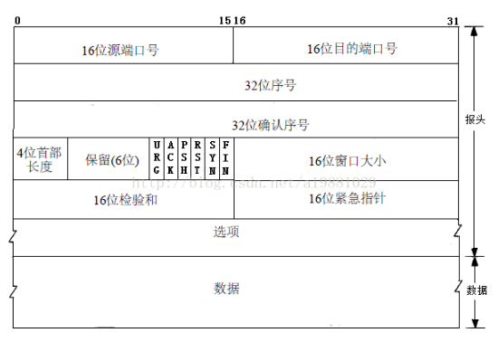

# 网络相关

## 分层

### 应用层

#### 1.HTTP （超文本传输协议）

1. 定义  
    1）提供了web客户向服务器请求页面的方式，以及服务器向客户传送web页面的方式  
    2）http使用tcp作为运输协议

2. 请求报文格式  
    1）实例：  
    (请求行)  
    GET /somedir/page.html HTTP/1.1 // 方法字段 URL字段 HTTP字段版本  
    （以下为首部行）  
    Host: wwwsomeschool.com  // 指明了对象所在的主机  
    Connection: close // 非持续性连接  
    User-agent: Mozilla/5.0 //浏览器类型  
    Accept-language: fr // 语言版本  
    （以下为实体体)  
    ...  
    ...  
    2）方法字段包括：  
    GET（获取，实体体为空）  
    POST（提交表单，实体体不为空）  
    HEAD（类似GET，但是服务器会返回一个报文进行响应，而不返回请求对象，常用来调式跟踪）  
    PUT（允许用户上传对象到服务器）  
    DELETE（允许用户删除服务器上的对象）  

3. 响应报文格式  
    1）实例  
    （状态行）  
    HTTP/1.1 200 OK // 协议版本 状态码 状态信息  
    （实体体）  
    Connection:close // 发送完后关闭tcp连接  
    Date: Tue, 09 Aug 2011 // 服务器产生并发送响应报文的时间  
    Server: Apache/2.3.3 // 类似于请求报文的User-agent  
    Last-Modified:Tue, 09 Aug 2011 // 对象创建或者最后修改的时间  
    Content-Length: 6821 // 发送对象中的字节数  
    Content-Type: text/html // 对象是html文本  
    2）状态码  
    200 OK： 请求成功  
    301 Move Permanently：请求的对象被永久性转移  
    400 Bad Request：请求不能被服务器理解  
    404 Not Found：请求不在服务器上  
    505 不支持使用的http协议  

4. 区别  
    HTTP 与 HTTPS  
    1）http传送是按明文传送，因此安全性不高，https是http的安全版本，http+ssl安全协议 = https，提供加密传输和身份认证  
    2）使用完全不同的连接方式，http是80，https是443  
    HTTP 1.1 与 HTTP 1.0  
    1）1.0 需要使用keep-alive告知服务端要建立一个长连接，而1.1 默认支持长连接  
    2）1.1 支持先只发送head信息，确认权限后（收到100），再发送body信息  
    3）1.1 支持host域  
    HTTP 2.0 与 HTTP 1.x  
    1）多路复用：同一个连接并发处理多个请求  
    2）数据压缩：支持对head数据的压缩  
    3）服务器推送：请求数据时，服务器会顺便把一些资源推给客户端  

#### 2.gRPC - 基于http/2协议标准设计

1. 特点
    - 二进制，http是基于文本，因此更紧凑与高效
    - 多路复用
    - 浏览器不可读

#### 3.FTP （文件传输协议）

#### 4.DNS（域名服务）

1. 定义  
    将用户提供的主机名解析为IP地址 = 分层的分布式数据库 + 能够查询分布式数据库的应用层协议  
    运行在UDP协议上，端口号为53  

2. 解析过程  
    1）查找浏览器缓存  
    2）查找系统缓存 /etc/hosts  
    3）路由缓存  
    4）ISP的DNS服务器  
    5）向根服务器发送请求  

#### 5.相关问题  

1. cookie机制  
    1）四个组件  
    a.http响应报文中一个cookie首部行  
    b.http请求报文中一个cookie首部行  
    c.用户端系统中保留一个cookie文件  
    d.web站点的后端数据库  
    2）机制  
    用户端用cookie文件存储标识，服务器由数据库存储标识，通过cookie号来标记用户，使得后台能够进行操作  
    3）在客户端保持状态的方案  

2. session机制  
    1）定义：用来在客户端与服务器之间保持状态的解决方案  
    2）在服务端保持状态的方案，标记某会话  

3. web缓存（代理服务器）  
    1）作用  
    可以使得用户的所有http请求首先指向web缓存器，若缓存器已存储web，则直接响应，若无存储，则向原始页面发送请求消息  
    2）使用原因  
    a.可以减少对客户请求的响应时间  
    b.可以减少一个机构的接入链路到因特网的通信量  

### 运输层

#### 1.UDP

1. 报文格式  
      
    1）首部8字节  

#### 2.TCP

1. 报头格式  

    

    1）最小20字节 = 5*32 bit （一行32位，共5行）  
    6）序号：报文段首字节的字节流编号（因为要将数据分组，序号建立在传输的字节流上）  
    7）确认号：主机A通过确认号期望从主机B下一条消息获取数据，如A收到了0-655数据，接下来想要656后面的数据，就给B发送656  
    <https://blog.csdn.net/a19881029/article/details/29557837>  

2. 状态控制码  
    1）ACK：确认比特，只有ACK=1，包有效  
    2）SYN：同步比特，主动连接对方  
    3）FIN：终止比特，FIN=1，表示此发送端数据已发送完毕  

3. 鉴权方式 （三次握手）
  
    

    1）三次握手原因：
    - 防止已失效的连接请求干扰
    - 可靠信道至少需要三次完成连接
    - 双方都要确认对方收到了自己的序列号，确认过程需要三次

4. 断连方式（四次挥手）  

    

    1) 为什么要进行4次挥手？  
    - 因为每次发送fin只是单方面表示不会再发数据，但是仍然能够接受数据  

    2) A 等待一段时间的原因  
    - 让该链接的所有的报文在等待时间中消失
    - 确保最后一个报文能够到达，若未成功还能进行重传

### 网络层

#### 1.IP （网际协议）

### 链路层

1. 定义：沿着通信路径连接相邻结点的通信信道称为链路  
2. 网络层IP地址实现主机之间的通信，而链路层实现具体每段链路之间的通信，整个过程中IP地址不变，而mac地址会随着链路改变  
3. ARP协议：根据IP地址获取MAC地址  

### 物理层

## 其他

1. 套接字  
    IP地址 + 端口号 + 网络协议 = 套接字  
2. 交换机与路由器的区别  
    交换机：通过mac地址  
    路由器：通过ip地址  
3. 各层传的数据类型
    - 物理层：bit
    - 链路层：帧
    - 网络层：包/分组
    - 传输层/应用层：报文

## 请求一个web页面的全过程  

<https://blog.csdn.net/u014497502/article/details/50936798 >  
总: 知道自己这边的所有信息 ip + mac, 并且知道对方的 ip (通过 dns 解析)就可以开始建立通信

1. 获取本机IP （DHCP）  
本机 -> 交换机 -> 路由网关  
回来的时候已经得知自己的IP、路由IP、DNS的IP  
2. 获取网关的mac（已知路由IP）址 （ARP）  
3. 获取目标IP地址（DNS解析）  
4. 建立通信TCP  
5. 请求网页HTTP  

## 其他网络协议

## 1.NAT

## 2.STUN

可以通过STUN服务器得到私网的公网nat地址  

## 3.TURN

当STUN仍然不能打通时，通过TURN服务器进行中转  

## 4.SDP

会话描述格式

## 5.RTP - 实时传输协议

PTCP:控制包  
PTR:媒体数据  

流媒体使用UDP传输，是延迟和无序的，因此使用缓存播放

4.1.  怎样重组乱序的数据包
可以根据RTP包的序列号来排序。

4.2.  怎样获得数据包的时序
可以根据RTP包的时间戳来获得数据包的时序。

4.3.  声音和图像怎么同步
根据声音流和图像流的相对时间（即RTP包的时间戳），以及它们的绝对时间（即对应的RTCP包中的RTCP），可以实现声音和图像的同步。

4.4.  接收缓冲和播放缓冲的作用
接收缓冲用来排序乱序了的数据包；播放缓冲用来消除播放的抖动，实现等时播放。