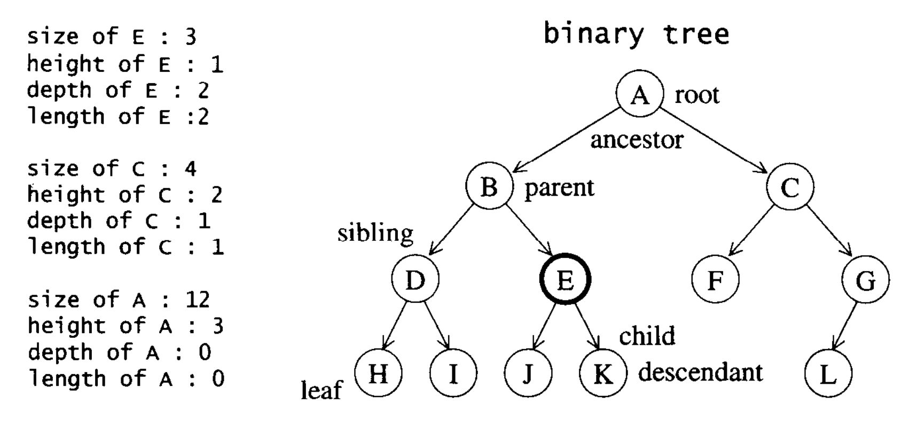

# 树

## 基本



## 二叉树分类

- 完全二叉树
  - n-1 层铺满 + n 层允许只有左边 

## 二叉搜索树

- 遵循左小右大的规则

## 平衡二叉搜索树

保持整体深度为 O(logN)  
查找/ 增加/ 删除 效率 O(logN)

- AVL树
  - 遵循左右子树高度差为 1
- 红黑树
  - 根据红黑的一定规则
- 对比 红黑树比AVL树的优势？  
  - AVL严格按照平衡二叉树去旋转，可能会导致更多旋转操作；  
  - 红黑树牺牲了一定的平衡性，旋转次数不超过3次的条件下保持一个合理的高度

## B树

### B树

1.使用B树作为索引树的原因  
虽然红黑树的查找效率更好，但是由于内存读取的局部性，红黑树节点的实际物理地址离得比较远，导致频繁从磁盘读取，影响速度  
而B树将节点按顺序放在一起，并且起到了索引的作用，减少了向磁盘的读取  

### B+树

1.优点  
1）非叶子节点只存储索引，不存储数据，进而能存储更多的索引  
2）数据都在叶子节点上，并且通过链表相连接，因此可以扫库，通过链表一次读取所有

## 应用

### 求树的高度

```c
int getDepth(TreeNode* root)
{
    if (root == NULL) return 0;
    return max(getDepth(root->left), getDepth(root->right)) + 1;
}

```

### 数的遍历

#### 前序遍历

```c
void preFindNode(TreeNode *root)
    {
        if (root == nullptr) return;
 
        std::cout << root->val << endl;
        preFindNode(root->left);
        preFindNode(root->right);
 
        // 非递归版
        if (root == nullptr) return;
        stack<TreeNode*> treeStack;
        while (root != nullptr || !treeStack.empty())
        {
            if (root != nullptr)
            {
                cout << root->val << endl;
                treeStack.push(root);
                root = root->left;
            }
            else
            {
                root = treeStack.top();
                treeStack.pop();
                root = root->right;
            }
        }
    }
```

#### 中序遍历

```c
    void midFindNode(TreeNode *root)
    {
        if (root == nullptr) return;
        midFindNode(root->left);
        std::cout << root->val << endl;
        midFindNode(root->right);
 
        // 非递归版
        if (root == nullptr) return;
        stack<TreeNode*> treeStack;
        while (root != nullptr || !treeStack.empty())
        {
            if (root != nullptr)
            {
                treeStack.push(root);
                root = root->left;
            }
            else
            {
                root = treeStack.top();
                cout << root->val << endl;
                treeStack.pop();
                root = root->right;
            }
        }
    }

```

#### 后序遍历

```c
    void tailFindNode(TreeNode *root)
    {
        if (root == nullptr) return;
        tailFindNode(root->left);
        tailFindNode(root->right);
        std::cout << root->val << endl;
 
        // 非递归版 利用双栈实现
        stack<TreeNode*> treeStack1;
        stack<TreeNode*> treeStack2;
 
        treeStack1.push(root);
        while (!treeStack1.empty())
        {
            root = treeStack1.top();
            treeStack1.pop();
 
            treeStack2.push(root);
            if (root->left)
            {
                treeStack1.push(root->left);
            }
 
            if (root->right)
            {
                treeStack1.push(root->right);
            }
        }
 
        while (!treeStack2.empty())
        {
            TreeNode *tmp = treeStack2.top();
            treeStack2.pop();
            cout << tmp->val << endl;
        }
    }

```